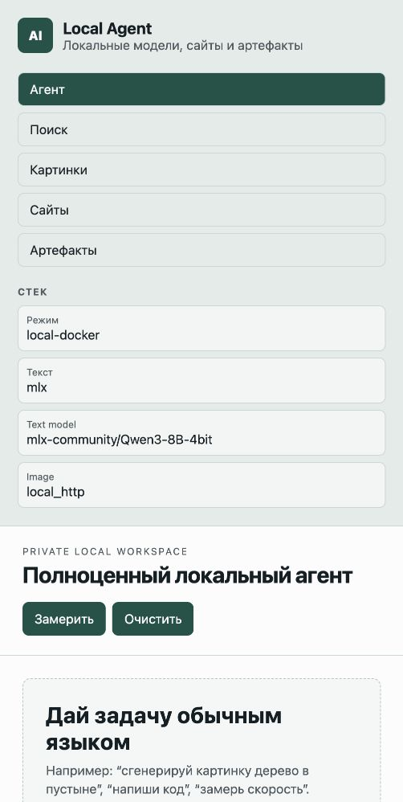
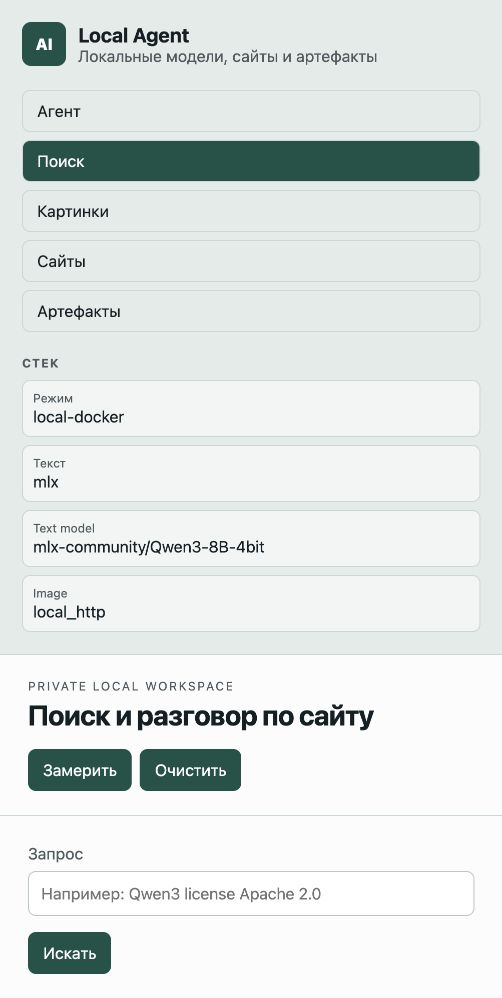
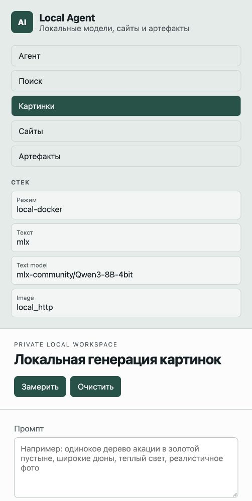
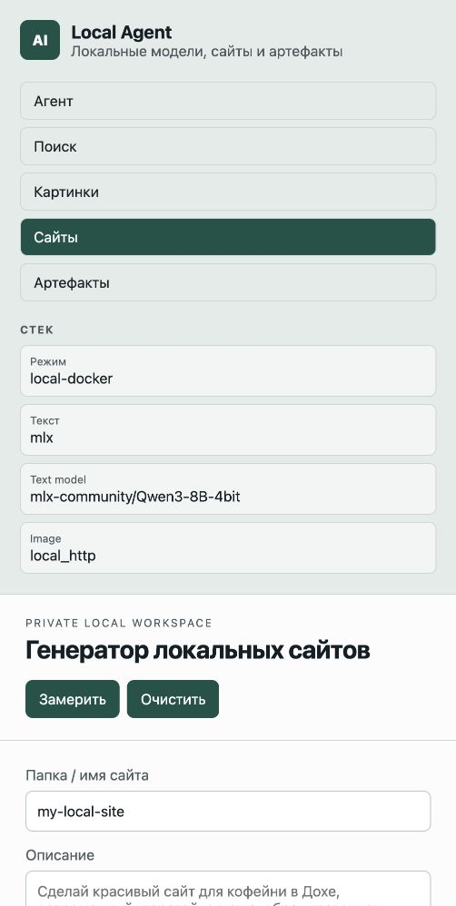
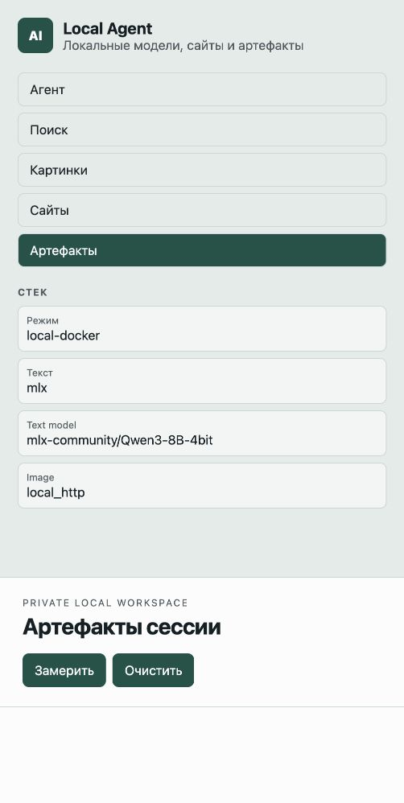

# Public AI Service Prototype

This repository is a first technical baseline for a public AI service built on
open-weight models and infrastructure under our control.

The prototype intentionally does not call external model APIs. It exposes a
small service API with mock adapters so product and evaluation flows can be
developed before renting GPU servers.

## Contents

- `docs/technical-plan.md` - architecture, model choices, licensing notes,
  infrastructure plan, and milestones.
- `eval/tasks.jsonl` - starter verification set for Russian, code, documents,
  search/RAG, image, and video workflows.
- `prototype/` - FastAPI service skeleton with provider adapters.

## Interface Preview

The current local workspace has separate sections for the agent, web search,
image generation, local site creation, and session artifacts.

### Agent



### Search



### Images



### Sites



### Artifacts



## Local Run, Mock Backend

```bash
cp .env.example .env
cd prototype
python3 -m venv .venv
. .venv/bin/activate
pip install -r requirements.txt
uvicorn app.main:app --reload --port 8080
```

Open:

```text
http://127.0.0.1:8080
```

Try API:

```bash
curl -sS http://127.0.0.1:8080/health
curl -sS http://127.0.0.1:8080/v1/chat/completions \
  -H 'content-type: application/json' \
  -d '{"model":"router-default","messages":[{"role":"user","content":"Составь краткий план запуска ИИ-сервиса"}]}'
```

## Local Apple GPU

See `docs/local-mac-gpu.md`.
See `docs/production-readiness.md` for the runnable checklist.

This project can connect to a local MLX or llama.cpp Metal server through
OpenAI-compatible endpoints:

```env
TEXT_BACKEND=mlx
TEXT_BACKEND_URL=http://127.0.0.1:8000/v1
```

Then measure speed:

```bash
python3 scripts/benchmark_chat.py --runs 3
```

## Docker

Recommended managed run:

```bash
bash scripts/run_stack.sh
```

Keep that terminal open. Press `Ctrl+C` in it to stop Docker API/UI, the local
MLX text model process, and the local image worker, so the laptop stops doing
inference work.

Detached start:

```bash
bash scripts/docker_start.sh
```

Stop everything, including the local MLX model process:

```bash
bash scripts/docker_stop.sh
```

Status:

```bash
bash scripts/docker_status.sh
```

On macOS, Docker containers cannot directly use the Apple Metal/MPS GPU. The
Docker stack therefore runs API/UI in containers and runs local model workers on
the Mac host, managed by the start/stop scripts:

- text: MLX on `127.0.0.1:8000`;
- images: Diffusers image worker on `127.0.0.1:8188`.

The current local image baseline is `runwayml/stable-diffusion-v1-5`. It is
enough to prove the local workflow, but not the final quality target for the
public service.

## Mac App Shell

After cloning on macOS Apple Silicon, run one setup command:

```bash
bash scripts/setup_after_clone.sh
```

It installs dependencies and downloads the configured local models.

Run as a Mac desktop shell:

```bash
npm run app
```

The Electron shell starts the local stack, waits for `http://127.0.0.1:8080`,
opens the agent workspace, and stops Docker/MLX/image worker when the app quits.

Build a `.app` package:

```bash
bash scripts/build_for_platform.sh
```

Full clone/setup notes: `docs/clone-setup.md`.
Platform build notes: `docs/platform-builds.md`.

## Sites Tab

The `Сайты` tab creates local static sites in:

```text
generated_sites/<site-name>
```

Each generated site is also served for preview at:

```text
http://127.0.0.1:8080/generated-sites/<site-name>/index.html
```

## Images Tab

The `Картинки` tab sends prompts to the local image worker. Generated files are
stored in:

```text
image_worker/outputs/
```

## Search Tab

The `Поиск` tab provides a local retrieval workflow:

1. Search the web through the backend.
2. Select a result.
3. The backend reads and cleans the selected page.
4. Continue asking questions about that page with the local text model.

This uses ordinary web requests for retrieval; answers are generated by the
configured local model, not an external model API.

## Models Tab

The `Модели` tab shows the registered text, image, and video models. Users can:

- switch the active text/image model used by agent requests;
- add a custom model by Hugging Face model ID or model-card URL;
- copy a download command for the selected model.

Download a model after clone:

```bash
bash scripts/download_model.sh mlx-community/Qwen2.5-Coder-7B-Instruct-4bit
```

Run the stack with a different MLX model:

```bash
MODEL="mlx-community/Qwen2.5-Coder-7B-Instruct-4bit" bash scripts/run_stack.sh
```

Note: `mlx_lm server` is a single-model local worker. Switching models in the UI
changes the active model ID used by requests, but the MLX worker must be
restarted with that model ID before inference. Multi-model servers such as vLLM
can serve several registered models behind one OpenAI-compatible endpoint.

When the UI is opened through the Electron Mac app, the `Перезапустить text
worker` button can restart the managed local stack with the selected model. When
the UI is opened in a normal browser, the same panel shows the exact shell
command instead, because browsers cannot safely control local host processes.

## Production-Like Next Step

Run the evaluation set against candidate models on rented GPU instances only
after explicit approval for the server spend.
